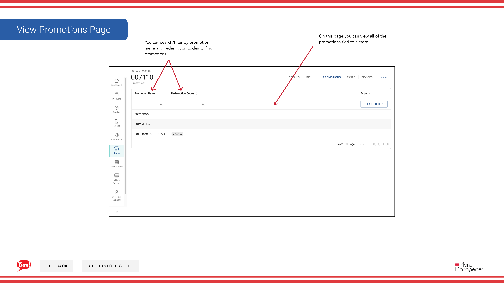

# プロモーションを確認する

## このガイドで扱う内容

このガイドでは、Byte Commerce Admin Portal でプロモーションを確認する手順を説明します。

## 手順

**ステップ 1:** まず、こちらをクリックして Stores 画面に移動します。
**ステップ 2:** 店舗は名称、番号、またはフランチャイズコードで検索できます。

**ステップ 3:** Once you find the store you are looking for, click on the stacked dots to open the option window.

**ステップ 4:** on Promotions をクリックします。

## 注意事項

:::note
There are other options in the window  but for this step we are just looking at Promotions. Others are discussed else where. Please go to the Table of Contents to find where.
:::

## 追加情報

- 店舗 - Viewing Promotions
- On this page you can view all of the promotions tied to a store
- You can search/filter by promotion name and redemption codes to find promotions

---

*[管理ポータルガイド](/docs/admin-portal-guide) の一部 · セクション: 店舗*