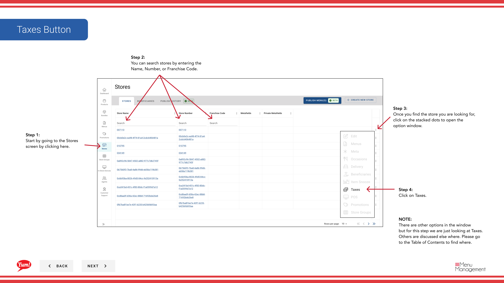

# 税設定を確認する

## このガイドで扱う内容

このガイドでは、Byte Commerce Admin Portal で税設定を確認する手順を説明します。

## 手順

**ステップ 1:** まず、こちらをクリックして Stores 画面に移動します。
**ステップ 2:** 店舗は名称、番号、またはフランチャイズコードで検索できます。

**ステップ 3:** Once you find the store you are looking for, click on the stacked dots to open the option window.

**ステップ 4:** on Taxes をクリックします。

## 注意事項

:::note
There are other options in the window  but for this step we are just looking at Taxes. Others are discussed else where. Please go to the Table of Contents to find where.
:::

:::note
The tax information (tax rule groups and associated tax rules ) for a store is separated by store groups
:::

---

*[管理ポータルガイド](/docs/admin-portal-guide) の一部 · セクション: 店舗*