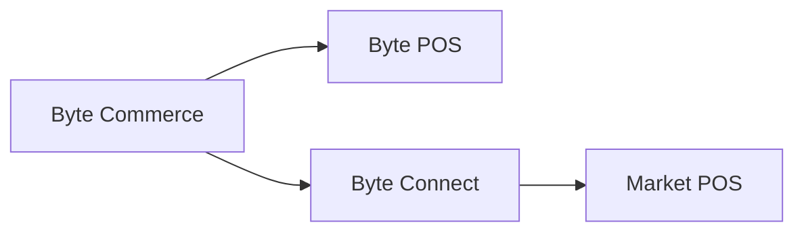

# Byte Connect

> Atlas の文脈では、Byte Connect は Byte Platform 内の統合レイヤーであり、Byte Commerce が非 Byte POS 環境や外部販売チャネルへ到達する必要があるときに重要になります。

---

## Atlas における位置づけ

Atlas Wiki では、Byte Connect は **Atlas + Byte Commerce + Byte Portal** の運用全体像の一部として理解するのが適切です。

- **Atlas** は KFC のグローバルフロントエンド
- **Byte Commerce** は取引ロジックと注文オーケストレーションを担う
- **Byte Portal** は市場設定と運用設定の主要な管理画面
- **Byte Connect** は外部チャネル連携や非 Byte POS 接続が必要なときに入る統合レイヤー

つまり Byte Connect は顧客向けプロダクトでも日常運用の主 UI でもありませんが、外部チャネル連携や非 Byte POS 構成を持つ市場では Byte stack の一部です。

---

## 基本ルール

市場が **Byte POS** を使っていない場合、**Byte Connect は Byte Commerce オンボーディングの一部として必ず導入する必要があります。**

Byte Commerce は **Byte POS** と直接通信する前提で構築されています。非 Byte POS 市場では、Byte Connect が中間に入り、その市場 POS への接続経路を担います。

---

## Byte Connect の役割

Byte Connect は Byte Platform 内の統合ソリューションであり、主に **Business API** を通じて管理されます。店舗やブランドが Byte Commerce を次の相手先と接続するために使われます。

- 非 Byte POS 環境
- 外部デリバリーマーケットプレイス
- その他の外部販売チャネル

Atlas の文脈では、標準の **Byte Commerce -> Byte POS** 経路の外側へプラットフォームを接続するためのレイヤーとして捉えるのが最も分かりやすいです。

つまり、運用上の理解は次の通りです。

- 市場が Byte POS を使う場合: **Byte Commerce -> Byte POS**
- 市場が Byte POS を使わない場合: **Byte Commerce -> Byte Connect -> POS**

避けるべき最大の誤解は、「Byte Commerce はどの市場 POS や外部チャネルとも標準で直接連携できる」という前提です。そうではありません。Byte POS がない場合、または市場がサポート対象の外部チャネル連携に依存する場合、Byte Connect が経路の一部になります。

---

## 主な機能

Byte Connect は次のような機能を担えます。

- **外部販売チャネル連携**: Uber Eats、DoorDash、Grubhub、Just Eat、Deliveroo など
- **チャネル別価格制御**: マーケットプレイス手数料を考慮したマークアップ設定
- **配達方式の切り替え**: マーケットプレイス配達か、自社配達かの選択
- **ドライバー向け指示ルール**: 注文ハンドリングのためのルール設定
- **店舗単位のチャネル設定**: `updateByteConnectStoreChannelConfig` などの Business API 操作による管理

Atlas での理解として重要なのは、Byte Connect は単なるコネクタではなく、市場の店舗が外部デリバリーチャネルや非 Byte POS 基盤とどう接続するかを制御する、設定可能な統合レイヤーだという点です。

---

## オンボーディング上の意味

非 Byte POS 市場にとって、Byte Connect は任意オプションではありません。Byte Commerce オンボーディングの標準構成の一部です。

市場セットアップ、ローンチ範囲、スケジュール、統合責任、アグリゲーター対応を計画するチームは、次の条件に当てはまる場合 Byte Connect を標準依存として扱う必要があります。

- 市場 POS が Byte POS ではない
- 市場がサポート対象の外部デリバリーチャネルに依存する
- 店舗単位の外部チャネル設定を中央管理する必要がある

Atlas の実務では、これは Byte Connect をフロントエンドや Portal 設定の後付けではなく、統合準備の一部として最初から扱うべきだという意味です。

---

## 運用上の注意

Byte Connect の多くの機能は現在 **BETA** とされており、すべての本番環境で同じように利用できるとは限りません。これらの操作には通常、Business API の `byte_connect` ロールが必要です。

Atlas の観点では、市場ごとに Byte Connect で使える機能面が同一だと決めつけないことが重要です。

---

## このページを参照する場面

次の説明が必要なときは、このページを参照してください。

- Byte Commerce がすべての POS と直接連携しない理由
- 非 Byte POS 市場で Byte Connect が必要な理由
- アグリゲーターや外部販売チャネル設定が、通常の Portal 中心の運用説明だけでは完結しない理由
- 非 Byte POS 市場で Byte Commerce がどのように店舗システムへ到達するか
- サポート対象の外部デリバリーチャネル設定が、フロントエンドだけでなく統合レイヤーでも管理される理由

---

:::tip 関連リンク
- [機能境界](/docs/byte-capabilities/enablement/capability-boundaries)
- [Commerce Backend Reference](/docs/byte-capabilities/reference/commerce-backend)
- [プラットフォーム全体像](/docs/byte-capabilities/mental-model)
:::
